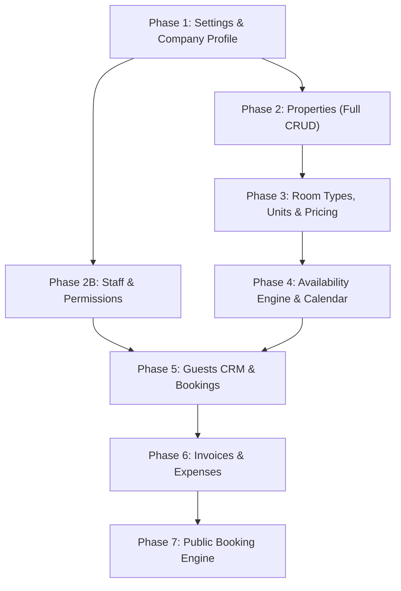

# PropertyOS — Backend Implementation Roadmap

This document provides a **dependency-ordered, module-by-module roadmap** for building the entire PropertyOS backend. Each phase is sequenced so that no module depends on something that hasn't been built yet.

---

## Current State (Already Built)

| Layer | Status | Details |
| :--- | :--- | :--- |
| **Auth & Sessions** | ✅ Done | Better Auth with email/password, Google OAuth, sessions, organization plugin |
| **Tenancy (Organizations)** | ✅ Done | Organization CRUD, member/invitation management, phone verification |
| **Onboarding Flow** | ✅ Done | Multi-step onboarding with org creation, phone verification |
| **Property (Basic)** | ✅ Partial | Create + List properties. Room type auto-created with `qty=1`. No detail/update/delete yet |
| **Server Core** | ✅ Done | Hono app, CORS, session middleware, error handling, router factory |
| **Database** | ✅ Done | Drizzle ORM + PostgreSQL, schema barrel exports, migrations |

---

## The Roadmap (7 Phases)



---

## Phase 1: Settings & Company Profile
**Why first:** Settings stores company identity (business name, GSTIN, logo) that appears on invoices, booking pages, and email templates. Other modules reference this data constantly.

### Schema Work (`packages/db`)
- [NEW] `organization_settings` — Extend org with: registered address, PAN, GSTIN, CIN, business email/phone, support email, website, invoice_prefix, invoice_auto_generate, default_tax_rate, default_tax_type, default_tax_label.
- [NEW] `notification_preferences` — Event × channel matrix (booking_confirmed → email, whatsapp, sms).
- [NEW] `audit_log` — Actor, action, entity_type, entity_id, before_json, after_json, timestamp.

### API Routes (`apps/server/src/modules/platform/settings/`)
| Method | Endpoint | Purpose |
| :--- | :--- | :--- |
| `GET` | `/settings/company` | Get company profile |
| `PUT` | `/settings/company` | Update company profile |
| `GET` | `/settings/notifications` | Get notification preferences |
| `PUT` | `/settings/notifications` | Update notification preferences |
| `GET` | `/settings/audit` | Paginated audit log |

### Deliverables
- [ ] Schema + migration for `organization_settings`, `notification_preferences`, `audit_log`
- [ ] Settings CRUD routes with Zod validation
- [ ] Audit log middleware (auto-record on mutations)

---

## Phase 2: Properties (Full CRUD + Configuration)
**Why second:** Every subsequent module (rooms, pricing, bookings, invoices, expenses) hangs off a `property_id`. The basic create/list exists but needs full CRUD, detail views, and configuration fields.

### Schema Work (`packages/db`)
- [MODIFY] `property` table — Add: slug, description, address_line2, pin_code, latitude, longitude, checkin_time, checkout_time, cancellation_policy, cancellation_hours, refund_percentage, house_rules, pet_policy, smoking_policy, event_policy, id_required, security_deposit, tax_rate, tax_type, tax_label, gstin, logo_url, accent_color, welcome_text, terms_url, invoice_prefix.
- [NEW] `property_amenities` — Property × amenity_key with category grouping.
- [NEW] `property_images` — Ordered gallery with room_type_id scope and is_cover flag.

### API Routes (`apps/server/src/modules/platform/property/`)
| Method | Endpoint | Purpose |
| :--- | :--- | :--- |
| `GET` | `/properties/:id` | Get property detail (full fields) |
| `PUT` | `/properties/:id` | Update property |
| `DELETE` | `/properties/:id` | Soft-delete (set status=inactive) |
| `PUT` | `/properties/:id/policies` | Update check-in/out, cancellation, house rules |
| `PUT` | `/properties/:id/tax` | Update tax configuration |
| `PUT` | `/properties/:id/branding` | Update logo, accent color, welcome text |
| `GET` | `/properties/:id/amenities` | List amenities |
| `PUT` | `/properties/:id/amenities` | Bulk upsert amenities |
| `GET` | `/properties/:id/images` | List images (ordered) |
| `POST` | `/properties/:id/images` | Upload image |
| `PUT` | `/properties/:id/images/reorder` | Reorder images |
| `DELETE` | `/properties/:id/images/:imageId` | Delete image |

### Deliverables
- [ ] Schema migration for extended property columns + amenities + images tables
- [ ] Full property CRUD with detail, update, soft-delete
- [ ] Amenities bulk upsert endpoint
- [ ] Image upload with S3/R2 integration + reorder endpoint

---

## Phase 2B: Staff & Permissions (Parallel with Phase 2)
**Why parallel:** Staff profiles and role-based access control are needed across every module. Can be built alongside Properties since they share no schema dependency.

### Schema Work (`packages/db`)
- [NEW] `staff_profiles` — Full personal info (name, phone, email, DOB, gender, address, emergency contacts, photo_url).
- [NEW] `staff_documents` — Document vault (aadhaar, pan, police_verification) with verification status.
- [NEW] `staff_property_assignments` — Links staff to properties with role + JSONB permissions.
- [NEW] `attendance` — Daily attendance records with unique constraint on (staff_id, property_id, date).

### API Routes (`apps/server/src/modules/platform/staff/`)
| Method | Endpoint | Purpose |
| :--- | :--- | :--- |
| `GET` | `/staff` | List staff (filterable by property, role) |
| `POST` | `/staff` | Create staff profile |
| `GET` | `/staff/:id` | Get staff detail |
| `PUT` | `/staff/:id` | Update staff profile |
| `DELETE` | `/staff/:id` | Remove staff |
| `POST` | `/staff/:id/documents` | Upload document |
| `PUT` | `/staff/:id/documents/:docId` | Verify/update document |
| `GET` | `/staff/:id/assignments` | List property assignments |
| `POST` | `/staff/:id/assignments` | Assign to property |
| `DELETE` | `/staff/:id/assignments/:assignId` | Remove assignment |
| `GET` | `/attendance` | Get attendance matrix (month, property filter) |
| `POST` | `/attendance/bulk` | Bulk mark daily attendance |
| `PUT` | `/attendance/:id` | Update single attendance record |

### Middleware Enhancement
- [ ] `requirePermission(capability, module)` middleware that checks `staff_property_assignments.permissions` JSONB against the requested action.

### Deliverables
- [ ] Schema migration for staff_profiles, staff_documents, staff_property_assignments, attendance
- [ ] Full staff CRUD + document upload routes
- [ ] Attendance bulk mark + monthly matrix query
- [ ] Permission middleware for role-based access control

---

## Phase 3: Room Types, Individual Units & Pricing Engine
**Why third:** Room types define "what's sellable." The pricing engine resolves rates for every quote, calendar cell, and booking. Everything downstream reads from here.

### Schema Work (`packages/db`)
- [MODIFY] `room_type` — Add: description, photos, base_price, weekend_price, extra_guest_price, base_guests, max_guests, min_nights, max_nights, bed_config, size_sqft, amenities_json, status.
- [NEW] `rooms` — Individual physical units (name, floor_group, status, sort_order, notes).
- [NEW] `rate_overrides` — Seasonal pricing blocks (label, start_date, end_date, custom_price, min_stay_override).

### API Routes (`apps/server/src/modules/platform/room-type/`)
| Method | Endpoint | Purpose |
| :--- | :--- | :--- |
| `GET` | `/properties/:id/room-types` | List room types for property |
| `POST` | `/properties/:id/room-types` | Create room type |
| `GET` | `/room-types/:id` | Get room type detail |
| `PUT` | `/room-types/:id` | Update room type |
| `DELETE` | `/room-types/:id` | Delete room type (check active bookings) |
| `GET` | `/room-types/:id/rooms` | List individual units |
| `POST` | `/room-types/:id/rooms` | Create/bulk-create units |
| `PUT` | `/rooms/:id` | Update unit (name, status, notes) |
| `GET` | `/room-types/:id/rate-overrides` | List rate overrides |
| `POST` | `/room-types/:id/rate-overrides` | Create rate override |
| `PUT` | `/rate-overrides/:id` | Update rate override |
| `DELETE` | `/rate-overrides/:id` | Delete rate override |

### Pricing Engine (`apps/server/src/modules/platform/pricing/`)
- [ ] `resolveNightlyRate(roomTypeId, date)` — Day-by-day rate resolution following precedence: custom_price override → weekend_price → base_price.
- [ ] `calculateBookingTotal(roomTypeId, checkIn, checkOut, guests, couponCode?)` — Full pricing pipeline: sum nightly rates + extra guest charges − coupon discount + tax.
- [ ] All money in **integer paise**. Floats touch money at exactly one place: the display layer.

### Deliverables
- [ ] Schema migration for extended room_type columns + rooms + rate_overrides
- [ ] Room type full CRUD + unit management
- [ ] Rate override CRUD
- [ ] Pricing engine service with day-by-day resolution

---

## Phase 4: Availability Engine & Calendar
**Why fourth:** Depends on room types, units, and pricing. The availability engine answers the core question: *"How many units of room type R are sellable on night N?"*

### Schema Work (`packages/db`)
- [NEW] `availability_rules` — Blocks and overrides on room types over date ranges (rule_type: 'blocked' | 'custom_price' | 'min_stay_override', units_affected, start_date, end_date).
- [NEW] `checkout_holds` — 10-minute concurrency reservation locks (room_type_id, date_range, units, expires_at, session_token).

### Core Engine (`apps/server/src/modules/platform/availability/`)
- [ ] `sellable(roomTypeId, night)` = `quantity − confirmed/pending bookings − blocked units − held units`
- [ ] `isRangeBookable(roomTypeId, checkIn, checkOut, units)` = `sellable >= units` for every night
- [ ] `getCalendarGrid(propertyId, startDate, endDate)` — Returns matrix of room types × dates with status, rate, and sellable count per cell.

### API Routes
| Method | Endpoint | Purpose |
| :--- | :--- | :--- |
| `GET` | `/properties/:id/calendar` | Calendar grid data (room types × dates) |
| `POST` | `/availability-rules` | Create block / custom price rule |
| `PUT` | `/availability-rules/:id` | Update rule |
| `DELETE` | `/availability-rules/:id` | Delete rule |
| `POST` | `/checkout-holds` | Create 10-minute hold (atomic) |

### Deliverables
- [ ] Schema migration for availability_rules + checkout_holds
- [ ] Availability engine with serialized transaction for hold creation
- [ ] Calendar grid endpoint returning room_type × date matrix
- [ ] Expired hold sweep (on-read + background cron)

---

## Phase 5: Guests CRM & Bookings
**Why fifth:** Bookings are the central business event. They depend on properties, room types, pricing, and availability. Guests CRM is the contact registry bookings reference.

### Schema Work (`packages/db`)
- [NEW] `guests` — Keyed on email/phone. name, email, phone, tags (jsonb), notes, lifetime_value, total_stays, last_stay_date, source.
- [NEW] `bookings` — guest_id, property_id, room_type_id, room_id (assigned unit), check_in, check_out, nights, units, guests_count, status (confirmed/checked_in/checked_out/cancelled/no_show), source (direct/airbnb/booking_com/manual), base_amount, discount_amount, tax_amount, total_amount, currency, coupon_code, special_requests, created_by, snapshotted pricing fields.
- [NEW] `coupons` — code, discount_type (flat/percent), discount_value, max_uses, uses_count, valid_from, valid_to, min_nights, applicable_room_types.
- [NEW] `guest_notes` — Timestamped host notes log per guest.

### API Routes (`apps/server/src/modules/platform/guests/` and `/bookings/`)

**Guests:**
| Method | Endpoint | Purpose |
| :--- | :--- | :--- |
| `GET` | `/guests` | List/search guests (with LTV, tags, repeat filters) |
| `POST` | `/guests` | Create guest |
| `GET` | `/guests/:id` | Guest detail + stay history |
| `PUT` | `/guests/:id` | Update guest |
| `POST` | `/guests/:id/notes` | Add host note |
| `PUT` | `/guests/:id/tags` | Update tags |

**Bookings:**
| Method | Endpoint | Purpose |
| :--- | :--- | :--- |
| `GET` | `/bookings` | List bookings (searchable, filterable, paginated) |
| `POST` | `/bookings` | Create booking (runs pricing engine + availability check) |
| `GET` | `/bookings/:id` | Booking detail with full audit timeline |
| `PUT` | `/bookings/:id` | Update booking (dates, room, guests) |
| `PUT` | `/bookings/:id/status` | Transition status (confirm → check-in → check-out → cancel) |
| `PUT` | `/bookings/:id/assign-room` | Assign specific unit to booking |
| `POST` | `/bookings/:id/cancel` | Cancel with refund calculation |

**Coupons:**
| Method | Endpoint | Purpose |
| :--- | :--- | :--- |
| `GET` | `/coupons` | List coupons |
| `POST` | `/coupons` | Create coupon |
| `POST` | `/coupons/validate` | Validate code for a given booking |
| `PUT` | `/coupons/:id` | Update coupon |
| `DELETE` | `/coupons/:id` | Delete coupon |

### Deliverables
- [ ] Schema migration for guests, bookings, coupons, guest_notes
- [ ] Guest CRM CRUD with LTV aggregation
- [ ] Booking creation pipeline (validate → price → check availability → hold → create)
- [ ] Booking status state machine (confirmed → checked_in → checked_out)
- [ ] Coupon validation engine

---

## Phase 6: Invoices & Expenses
**Why sixth:** Invoices reference bookings. Expenses reference properties and vendors. Both are financial ledgers that depend on the core entities from Phases 1–5.

### Schema Work (`packages/db`)
- [NEW] `invoices` — Linked to booking_id, guest info, status (draft/sent/partial/paid/overdue/cancelled), total_amount, amount_paid, public_token.
- [NEW] `invoice_items` — Line items (room, addon, fnb, service, fee, discount) with quantity, unit_price, tax_rate.
- [NEW] `invoice_reminders` — Sent reminder log (channel, status, sent_at, sent_by).
- [NEW] `expenses` — Property-scoped or HQ shared, with partial payment tracking (total_amount, amount_paid, status).
- [NEW] `expense_payments` — Installment ledger (amount, payment_method, payment_date, reference_id).
- [NEW] `vendors` — Supplier directory (name, contact, phone, email, gstin).

### API Routes

**Invoices:** (`/invoices/`)
| Method | Endpoint | Purpose |
| :--- | :--- | :--- |
| `GET` | `/invoices` | List invoices (filterable, paginated) |
| `POST` | `/invoices` | Create invoice (manual or from booking) |
| `GET` | `/invoices/:id` | Invoice detail with items + payment history |
| `PUT` | `/invoices/:id` | Update invoice |
| `POST` | `/invoices/:id/items` | Add line item |
| `DELETE` | `/invoices/:id/items/:itemId` | Remove line item |
| `POST` | `/invoices/:id/record-payment` | Record partial/full payment |
| `POST` | `/invoices/:id/send-reminder` | Send WhatsApp/Email reminder |
| `GET` | `/invoices/:id/pdf` | Generate downloadable PDF |

**Expenses:** (`/expenses/`)
| Method | Endpoint | Purpose |
| :--- | :--- | :--- |
| `GET` | `/expenses` | List expenses (filterable, paginated) |
| `POST` | `/expenses` | Create expense |
| `GET` | `/expenses/:id` | Expense detail with payment history |
| `PUT` | `/expenses/:id` | Update expense |
| `DELETE` | `/expenses/:id` | Delete expense |
| `POST` | `/expenses/:id/record-payment` | Record partial/full payment |
| `GET` | `/vendors` | List vendors |
| `POST` | `/vendors` | Create vendor |
| `PUT` | `/vendors/:id` | Update vendor |

### Deliverables
- [ ] Schema migration for invoices, invoice_items, invoice_reminders, expenses, expense_payments, vendors
- [ ] Invoice CRUD + line item management + payment recording
- [ ] Auto-generate invoice on booking confirmation
- [ ] PDF generation (using React-PDF or html-to-pdf)
- [ ] Expense CRUD + partial payment recording
- [ ] Vendor directory CRUD

---

## Phase 7: Public Booking Engine & Reports
**Why last:** The public booking engine is the guest-facing checkout flow that orchestrates everything: property display, availability checks, pricing calculations, coupon validation, 10-minute holds, gateway payments, booking creation, invoice generation, and WhatsApp dispatch. Reports read from all tables.

### Public Booking Engine (`apps/server/src/modules/public/`)
| Method | Endpoint | Purpose |
| :--- | :--- | :--- |
| `GET` | `/book/:slug/:propertySlug` | Public property data (photos, amenities, policies) |
| `POST` | `/book/:slug/:propertySlug/check` | Check availability for date range |
| `POST` | `/book/:slug/:propertySlug/checkout` | Create hold + return pricing summary |
| `POST` | `/book/:slug/:propertySlug/pay` | Process payment + create booking + generate invoice |
| `GET` | `/book/confirmation/:bookingId` | Confirmation page data |
| `GET` | `/quote/:token` | Private deal link data |
| `GET` | `/inv/:token` | Public invoice pay-link data |
| `POST` | `/inv/:token/pay` | Process invoice payment |

### Reports (`apps/server/src/modules/platform/reports/`)
| Method | Endpoint | Purpose |
| :--- | :--- | :--- |
| `POST` | `/reports/run` | Execute a standard or custom report template |
| `GET` | `/reports/templates` | List saved custom report templates |
| `POST` | `/reports/templates` | Save custom report template |
| `PUT` | `/reports/templates/:id` | Update saved template |
| `DELETE` | `/reports/templates/:id` | Delete saved template |
| `GET` | `/reports/schedules` | List email schedules |
| `POST` | `/reports/schedules` | Create scheduled report |
| `PUT` | `/reports/schedules/:id` | Update schedule |
| `DELETE` | `/reports/schedules/:id` | Delete schedule |
| `POST` | `/reports/export` | Generate CSV/Excel/PDF export |

### Deliverables
- [ ] Public booking engine (unauthenticated routes)
- [ ] Razorpay/Stripe webhook handlers
- [ ] WhatsApp notification dispatch (MSG91 / Meta API)
- [ ] Report execution engine with dynamic query builder
- [ ] Custom report template CRUD
- [ ] Scheduled report email cron job
- [ ] CSV/Excel/PDF export generators

---

## Summary Timeline

| Phase | Module | Depends On | Estimated Scope |
| :--- | :--- | :--- | :--- |
| **1** | Settings & Company Profile | Auth (done) | 3 tables, 5 endpoints |
| **2** | Properties (Full CRUD) | Phase 1 | 2 new tables + extended columns, 12 endpoints |
| **2B** | Staff & Permissions | Auth (done) | 4 tables, 13 endpoints, permission middleware |
| **3** | Room Types, Units & Pricing | Phase 2 | 2 new tables + extended columns, 12 endpoints, pricing engine |
| **4** | Availability Engine & Calendar | Phase 3 | 2 tables, 4 endpoints, core engine |
| **5** | Guests CRM & Bookings | Phases 2B + 4 | 4 tables, 18 endpoints, booking pipeline |
| **6** | Invoices & Expenses | Phase 5 | 6 tables, 17 endpoints, PDF gen |
| **7** | Public Booking Engine & Reports | Phase 6 | 0 new tables, 18 endpoints, webhooks, cron |

---

## Architecture Pattern (Per Module)

Every module follows the same 3-file pattern already established:

```
modules/platform/{module}/
├── {module}.routes.ts    # Hono routes + Zod validation
├── {module}.service.ts   # Business logic orchestration
└── {module}.repo.ts      # Drizzle DB queries (data access)
```

All money stored in **integer paise**. All dates stored as **UTC**. All queries scoped to `organization_id` (tenant isolation). All mutations logged to `audit_log`.
