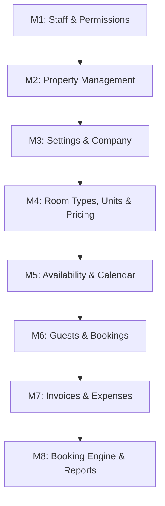

# PropertyOS — Backend Implementation Roadmap

A **checkbox-tracked, module-by-module** build plan. Every module breaks into
tasks; every task breaks into sub-tasks. Sub-tasks are sized so that a single
checkbox maps to a single unit of work — one endpoint, one table, one dialog
wired up. Nothing in the UI should be able to hide between two checkboxes.

**How to read this**

- `M1`, `M2`… = **Module** (a whole feature area)
- `M1.T1`, `M1.T2`… = **Task** (a coherent slice: schema, an entity's CRUD, a screen)
- `- [ ]` = **Sub-task** (the trackable unit)

Every sub-task that backs a UI control names the control in `→ UI:` so we can
confirm the button, filter, or dialog actually has an endpoint behind it.

---

## Build Order

**Management first** — Staff, Property, Settings — then the operational modules.



| # | Module | Status | Scope |
| :--- | :--- | :--- | :--- |
| **M1** | Staff & Permissions | 🔨 **In Progress** | 6 tables, ~30 endpoints, permission middleware |
| **M2** | Property Management | ⬜ Not started | 3 tables + extended columns, ~20 endpoints |
| **M3** | Settings & Company | ⬜ Not started | 6 tables, ~22 endpoints |
| **M4** | Room Types, Units & Pricing | ⬜ Not started | 2 tables, 12 endpoints, pricing engine |
| **M5** | Availability & Calendar | ⬜ Not started | 2 tables, 5 endpoints, availability engine |
| **M6** | Guests & Bookings | ⬜ Not started | 4 tables, 18 endpoints, booking pipeline |
| **M7** | Invoices & Expenses | ⬜ Not started | 6 tables, 17 endpoints, PDF gen |
| **M8** | Booking Engine & Reports | ⬜ Not started | 0 tables, 18 endpoints, webhooks, cron |

---

## Already Built

| Layer | Details |
| :--- | :--- |
| **Auth & Sessions** | Better Auth — email/password, Google OAuth, sessions, organization plugin |
| **Tenancy** | Organization CRUD, members, invitations, phone verification |
| **Onboarding** | Multi-step flow with org creation + phone verification |
| **Property (partial)** | `POST /properties`, `GET /properties` only. `room_type` auto-created at `qty=1` |
| **Server Core** | Hono app, CORS, `requireSession`, error handling, router factory |
| **Database** | Drizzle + PostgreSQL, schema barrel exports, migrations |

---

## Conventions (apply to every module)

- [ ] All money in **integer paise**. Floats touch money only at the display layer.
- [ ] All dates stored **UTC**; date-only fields use `date`, not `timestamp`.
- [ ] Every query scoped to `organization_id` — tenant isolation is non-negotiable.
- [ ] Every mutation writes to `audit_log`.
- [ ] Every list endpoint: `?page`, `?limit`, `?sort`, plus its own filters.
- [ ] Every route validates input with Zod before touching the service layer.

Module file pattern (already established):

```
modules/platform/{module}/
├── {module}.routes.ts    # Hono routes + Zod validation
├── {module}.service.ts   # Business logic
└── {module}.repo.ts      # Drizzle queries
```

---

# M1 — Staff & Permissions

**Frontend already built** (mock-data only, no API):
`features/staff/` — 22 components across Directory, Attendance, Roles & Permissions,
plus the staff detail page at `pages/(protected)/staff/$staffId.tsx`.

**Goal:** every control in those 22 components hits a real endpoint.

---

## M1.T1 — Schema & Migration

- [ ] `staff_profiles` — `id`, `organization_id`, `user_id?`, `full_name`, `phone`, `email?`, `date_of_birth?`, `gender?`, `address_line1?`, `address_line2?`, `city?`, `state?`, `pin_code?`, `emergency_name?`, `emergency_phone?`, `photo_url?`, `joined_at`, `status` (`active` | `pending_invite` | `archived`)
- [ ] `staff_documents` — `id`, `staff_id`, `type` (`aadhaar` | `pan` | `police_verification` | `photo_id`), `label`, `file_url`, `file_name`, `verified`, `verified_by?`, `verified_at?`, `uploaded_at`
- [ ] `roles` — `id`, `organization_id`, `key`, `name`, `description`, `is_system` (blocks deletion of built-ins)
- [ ] `role_permissions` — `role_id`, `module` (`calendar`|`bookings`|`guests`|`staff`|`finance`), `capability` (`view`|`create_edit`|`delete`|`export`), `allowed` — PK on (`role_id`,`module`,`capability`)
- [ ] `staff_property_assignments` — `id`, `staff_id`, `property_id`, `role_id`, `assigned_at`; unique on (`staff_id`,`property_id`)
- [ ] `attendance` — `id`, `staff_id`, `property_id`, `date`, `status` (`present`|`absent`|`on_leave`|`half_day`), `reason?`, `marked_by`, `marked_at`; **unique on (`staff_id`,`date`)**
- [ ] `staff_activity` — `id`, `staff_id`, `text`, `entity_type?`, `entity_id?`, `created_at`
- [ ] Indexes: `staff_profiles.organization_id`, `attendance.(staff_id,date)`, `staff_property_assignments.property_id`
- [ ] Seed the 4 system roles — Admin, Manager, Caretaker, Housekeeping — with the permission matrix from `mock-data.ts:459-520`
- [ ] Export all tables from `packages/db/src/schema/index.ts`
- [ ] Generate + run migration (`bun db:generate` → `bun db:migrate`)

## M1.T2 — Staff Directory (list, search, filter)

- [ ] `GET /staff` — list for org, joined with primary property + today's attendance status
- [ ] `?search=` — match on `full_name` **and** `phone` → UI: search box, `staff-directory.tsx:60`
- [ ] `?role=` — filter by role, `all` bypasses → UI: Role select, `staff-directory.tsx:67`
- [ ] `?property=` — filter by assignment, `all` bypasses → UI: Property select, `staff-directory.tsx:85`
- [ ] Include `todayStatus` per member so cards render without an N+1 → UI: `staff-card.tsx`
- [ ] Pagination + total count
- [ ] Empty-state contract: return `[]`, never 404 → UI: "No staff match your filters."

## M1.T3 — Staff Invite

- [ ] `POST /staff/invite` — create `staff_profiles` row at `status='pending_invite'`
- [ ] Validate: `full_name` required, `phone` required + E.164, `email` optional → UI: `invite-staff-dialog.tsx`
- [ ] Reject duplicate phone within org (409 with a usable message)
- [ ] Accept `role` (single) → UI: Assign Role select
- [ ] Accept `propertyIds[]` (**min 1**) and fan out into `staff_property_assignments` → UI: Assign Properties checkboxes
- [ ] Dispatch WhatsApp/SMS invite link → UI: toast promises "will receive a WhatsApp login link"
- [ ] `POST /staff/invite/:id/resend` — resend the link
- [ ] `GET /staff/invite/:token` — public: validate token for the accept screen
- [ ] `POST /staff/invite/:token/accept` — bind `user_id`, flip to `active`

## M1.T4 — Staff Profile CRUD

- [ ] `GET /staff/:id` — full detail: profile + documents + assignments + activity
- [ ] `PUT /staff/:id` — update personal info → UI: `personal-info-tab.tsx`
- [ ] Field coverage: name, phone, email, DOB, gender, address 1/2, city, state, PIN, emergency name/phone
- [ ] `POST /staff/:id/photo` — upload avatar (S3/R2), return `photo_url`
- [ ] `DELETE /staff/:id` — **soft-delete** to `archived`; block if the only Admin
- [ ] `POST /staff/:id/restore` — un-archive
- [ ] `GET /staff/:id/activity` — paginated → UI: `activity-log-tab.tsx`

## M1.T5 — Documents Vault

- [ ] `GET /staff/:id/documents` → UI: `documents-tab.tsx`
- [ ] `POST /staff/:id/documents` — upload, accept `type` + `label`
- [ ] Enforce type/size limits (PDF/JPG/PNG, cap at 5 MB) with a clear 400
- [ ] `PUT /staff/:id/documents/:docId/verify` — set `verified`, stamp `verified_by` + `verified_at`
- [ ] `DELETE /staff/:id/documents/:docId`
- [ ] Serve files via **signed, expiring URLs** — never public (Aadhaar/PAN are sensitive)

## M1.T6 — Workspace Assignments

- [ ] `GET /staff/:id/assignments` → UI: `workspaces-tab.tsx`
- [ ] `POST /staff/:id/assignments` — assign property + role → UI: `assign-workspace-dialog.tsx`
- [ ] Reject duplicate (staff, property) pairs
- [ ] `PUT /staff/:id/assignments/:assignId` — change role on an existing assignment
- [ ] `DELETE /staff/:id/assignments/:assignId` → UI: Remove button, `workspaces-tab.tsx:47`
- [ ] Block removing the last assignment of the org's last Admin

## M1.T7 — Roles & Permissions

- [ ] `GET /roles` — roles + permission matrix + live member counts → UI: `roles-permissions.tsx`
- [ ] `POST /roles` — create custom role → UI: `create-role-dialog.tsx`
- [ ] Validate: name required, unique per org; description optional
- [ ] New roles start all-deny (safe default)
- [ ] `GET /roles/:id/permissions` — 5 modules × 4 capabilities → UI: `permission-matrix.tsx`
- [ ] `PUT /roles/:id/permissions` — bulk upsert the matrix
- [ ] `PUT /roles/:id` — rename / re-describe
- [ ] `DELETE /roles/:id` — block when `is_system`, and when staff still hold it (409 listing them)
- [ ] **Matrix is currently read-only in the UI** — needs toggles wired to `PUT` (see Open Questions)

## M1.T8 — Attendance

- [ ] `GET /attendance?month=YYYY-MM&property=` — matrix of staff × days → UI: `attendance-matrix.tsx`
- [ ] Return sparse records; client fills the gaps (don't emit a row per staff per day)
- [ ] `GET /attendance/summary?month=&property=` — present/absent/on-leave today + monthly average → UI: `attendance-summary-band.tsx`
- [ ] `POST /attendance` — upsert one cell on the (`staff_id`,`date`) unique key → UI: `attendance-mark-dialog.tsx`
- [ ] Require `reason` when status is `on_leave` or `half_day` → UI: `attendance-mark-dialog.tsx:27`
- [ ] `POST /attendance/bulk` — quick-mark all staff for a date, defaults to `present` → UI: `quick-mark-banner.tsx`
- [ ] Bulk is **idempotent** — re-submitting overwrites, never duplicates
- [ ] Reject future dates
- [ ] `PUT /attendance/:id` / `DELETE /attendance/:id` — correct or clear a mark
- [ ] `GET /attendance/export?month=&property=` — CSV

## M1.T9 — Permission Middleware

- [ ] `requirePermission(module, capability)` for Hono
- [ ] Resolve caller → `staff_property_assignments` → `role_permissions`
- [ ] Org owner/Admin bypasses all checks
- [ ] Property-scoped routes check the assignment for **that** property, not any property
- [ ] Return 403 with `{ module, capability }` so the client can explain the denial
- [ ] Cache the permission set per request (avoid re-querying per guard)
- [ ] Apply across every M1 route
- [ ] `GET /me/permissions` — resolved matrix for the current user, so the UI can hide what it must

## M1.T10 — Wire the Frontend

- [ ] `features/staff/api/` — TanStack Query hooks mirroring `properties/api/use-properties.ts`
- [ ] Replace `mock-data.ts` imports across all 22 components
- [ ] Loading skeletons via the existing `skeleton-config` pattern
- [ ] Error + empty states on every list
- [ ] Optimistic updates for attendance cells (the grid must feel instant)
- [ ] Delete `lib/mock-data.ts` once nothing imports it

---

# M2 — Property Management

**Frontend already built:** `features/properties/` — 8 tabs (Overview, Amenities,
Gallery, Policies, Pricing, Rooms & Units, Taxes & Billing, Booking Links).
Backend has only list + create.

## M2.T1 — Schema & Migration

- [ ] Extend `property`: `slug`, `description`, `address_line2`, `pin_code`, `latitude`, `longitude`
- [ ] Extend `property` (policies): `checkin_time`, `checkout_time`, `cancellation_policy`, `cancellation_hours`, `refund_percentage`, `house_rules`, `pet_policy`, `smoking_policy`, `event_policy`, `id_required`, `security_deposit`
- [ ] Extend `property` (tax): `tax_rate`, `tax_type`, `tax_label`, `gstin`, `invoice_prefix`
- [ ] Extend `property` (branding): `logo_url`, `accent_color`, `welcome_text`, `terms_url`
- [ ] `property_amenities` — `property_id`, `amenity_key`, `category`, `enabled`
- [ ] `property_images` — `id`, `property_id`, `room_type_id?`, `url`, `sort_order`, `is_cover`
- [ ] Unique index on (`organization_id`,`slug`); auto-generate slug from name
- [ ] Generate + run migration

## M2.T2 — Property CRUD

- [ ] `GET /properties/:id` — full detail → UI: `overview-tab.tsx`
- [ ] `PUT /properties/:id` — update core fields
- [ ] `DELETE /properties/:id` — soft-delete to `inactive`; block with active bookings
- [ ] `GET /properties` — extend with `?search`, `?type`, `?status` → UI: `filter-toolbar.tsx`
- [ ] `GET /properties/:id/completeness` — setup-completeness score → UI: "Setup Completeness"

## M2.T3 — Policies, Tax & Branding

- [ ] `PUT /properties/:id/policies` → UI: `policies-tab.tsx`
- [ ] Validate `checkout_time` < `checkin_time` is allowed (overnight), reject malformed times
- [ ] `PUT /properties/:id/tax` → UI: `taxes-billing-tab.tsx` "Tax Configuration"
- [ ] Validate GSTIN format when present
- [ ] `PUT /properties/:id/branding` → UI: "Brand Customization"
- [ ] `POST /properties/:id/logo` — upload → UI: "Logo"

## M2.T4 — Amenities

- [ ] `GET /amenities/catalog` — master list grouped by category
- [ ] `GET /properties/:id/amenities` → UI: `amenities-tab.tsx`
- [ ] `PUT /properties/:id/amenities` — bulk upsert (single call for the whole grid)

## M2.T5 — Gallery

- [ ] `GET /properties/:id/images` — ordered → UI: `gallery-tab.tsx`
- [ ] `POST /properties/:id/images` — upload, optional `room_type_id` → UI: "Property Photos" / "Room Type Photos"
- [ ] `PUT /properties/:id/images/reorder` — accept the full ordered id list
- [ ] `PUT /properties/:id/images/:imageId/cover` — set cover (clears the previous)
- [ ] `DELETE /properties/:id/images/:imageId`
- [ ] Generate thumbnails on upload

## M2.T6 — Booking Links

- [ ] `GET /properties/:id/booking-links` → UI: `booking-links-tab.tsx`
- [ ] `POST /properties/:id/deal-links` — private deal link + token → UI: "Generate Private Deal Link"
- [ ] Accept stay-date constraints on the link → UI: "Stay dates"
- [ ] `DELETE /deal-links/:token` — revoke
- [ ] Public booking URL derives from `slug` → UI: "Public Booking Page"

## M2.T7 — Wire the Frontend

- [ ] Extend `features/properties/api/` beyond `use-properties.ts`
- [ ] Replace `properties/lib/mock-data.ts` across all 8 tabs
- [ ] Per-tab save states + validation errors

---

# M3 — Settings & Company

**Frontend already built:** `features/settings/` — 11 sections across General,
Billing, Integrations, Security, Danger Zone.

## M3.T1 — Schema & Migration

- [ ] `organization_settings` — registered address, PAN, GSTIN, CIN, business email/phone, support email, website, `invoice_prefix`, `invoice_auto_generate`, `default_tax_rate`, `default_tax_type`, `default_tax_label`
- [ ] `notification_preferences` — `organization_id`, `event`, `channel`, `enabled`
- [ ] `audit_log` — `actor_id`, `action`, `entity_type`, `entity_id`, `before_json`, `after_json`, `ip_address`, `created_at`
- [ ] `payment_gateway_configs` — `provider`, `key_id`, `key_secret` (**encrypted at rest**), `enabled`
- [ ] `security_settings` — password policy, session timeout, allowed OAuth providers
- [ ] `data_exports` — `id`, `requested_by`, `format`, `status`, `file_url?`, `expires_at`
- [ ] Generate + run migration

## M3.T2 — Company Profile

- [ ] `GET /settings/company` → UI: `company-profile-section.tsx`
- [ ] `PUT /settings/company` → UI: "Save Changes"
- [ ] Fields: Display Name, Slug, Business Email/Phone, Support Email, Website, GSTIN, PAN, City, State, Country, PIN
- [ ] Validate slug uniqueness + GSTIN/PAN formats

## M3.T3 — Members

- [ ] `GET /settings/members` — members + roles + joined dates → UI: `members-section.tsx`
- [ ] `POST /settings/members/invite` → UI: `invite-member-dialog.tsx` "Send Invite"
- [ ] `PUT /settings/members/:id/role` — change role
- [ ] `DELETE /settings/members/:id` — remove; block removing the last owner
- [ ] `POST /settings/members/:id/resend-invite`
- [ ] These proxy Better Auth's organization plugin — don't duplicate its tables

## M3.T4 — Plan, Usage & Billing

- [ ] `GET /settings/plan` — current plan + usage counters → UI: `plan-usage-section.tsx`
- [ ] `POST /settings/plan/change` → UI: "Change Plan"
- [ ] `GET /settings/billing-invoices` — paginated → UI: `billing-invoices-section.tsx`
- [ ] `GET /settings/billing-invoices/:id/pdf` — download

## M3.T5 — Payment Gateways

- [ ] `GET /settings/gateways` — **mask secrets** in the response → UI: `payment-gateways-section.tsx`
- [ ] `PUT /settings/gateways/:provider` — save credentials → UI: "Connect"
- [ ] Encrypt `key_secret` at rest; never return it in full
- [ ] `POST /settings/gateways/:provider/test` — verify credentials
- [ ] `DELETE /settings/gateways/:provider` — disconnect
- [ ] Providers: Razorpay, Stripe, Twilio, Gupshup

## M3.T6 — Notifications

- [ ] `GET /settings/notifications` — event × channel matrix → UI: `notifications-section.tsx`
- [ ] `PUT /settings/notifications` — bulk upsert
- [ ] Channels: Email, WhatsApp, SMS

## M3.T7 — Security

- [ ] `GET /settings/security` → UI: `security-section.tsx`
- [ ] `PUT /settings/security` — password policy, session timeout, OAuth providers
- [ ] `GET /settings/sessions` — active sessions (device, IP, location)
- [ ] `DELETE /settings/sessions/:id` — revoke one
- [ ] `POST /settings/sessions/revoke-all` — revoke all but current

## M3.T8 — Audit Log

- [ ] `GET /settings/audit` — paginated, `?actor`, `?action`, `?entity`, `?from`, `?to` → UI: `audit-log-section.tsx`
- [ ] Audit middleware auto-recording every mutation
- [ ] `GET /settings/audit/export` — CSV
- [ ] Audit rows are **append-only** — no update or delete route

## M3.T9 — Data Export & Danger Zone

- [ ] `POST /settings/export` — queue CSV/XLSX job → UI: `data-export-section.tsx`
- [ ] `GET /settings/export/:id` — poll status, return signed URL when ready
- [ ] `POST /settings/transfer-ownership` — requires confirmation → UI: `danger-zone-section.tsx`
- [ ] `DELETE /settings/organization` — cascade delete → UI: "Delete Organization"
- [ ] Both danger actions: re-authenticate + type-to-confirm → UI: `confirm-destructive-dialog.tsx`

## M3.T10 — Wire the Frontend

- [ ] `features/settings/api/` hooks
- [ ] Replace `settings/lib/mock-data.ts` across all 11 sections
- [ ] Per-section save + error states

---

# M4 — Room Types, Units & Pricing

> Detail expands when M3 completes. Summary retained for sequencing.

- [ ] **M4.T1** Schema: extend `room_type` (description, photos, base/weekend/extra-guest price, base/max guests, min/max nights, bed config, size, amenities, status); new `rooms`, `rate_overrides`
- [ ] **M4.T2** Room type CRUD — 5 endpoints
- [ ] **M4.T3** Individual unit management — create, bulk-create, update
- [ ] **M4.T4** Rate override CRUD — 4 endpoints
- [ ] **M4.T5** `resolveNightlyRate(roomTypeId, date)` — precedence: override → weekend → base
- [ ] **M4.T6** `calculateBookingTotal(...)` — nightly sum + extra guests − coupon + tax
- [ ] **M4.T7** Wire `pricing-tab.tsx` + `rooms-units-tab.tsx`

---

# M5 — Availability & Calendar

- [ ] **M5.T1** Schema: `availability_rules`, `checkout_holds`
- [ ] **M5.T2** `sellable(roomTypeId, night)` = qty − booked − blocked − held
- [ ] **M5.T3** `isRangeBookable(...)` across every night in range
- [ ] **M5.T4** `GET /properties/:id/calendar` — room types × dates matrix
- [ ] **M5.T5** Availability rule CRUD
- [ ] **M5.T6** `POST /checkout-holds` — 10-min hold in a **serialized transaction**
- [ ] **M5.T7** Expired-hold sweep (on-read + background cron)

---

# M6 — Guests & Bookings

- [ ] **M6.T1** Schema: `guests`, `bookings`, `coupons`, `guest_notes`
- [ ] **M6.T2** Guest CRM CRUD + LTV aggregation — 6 endpoints
- [ ] **M6.T3** Booking pipeline: validate → price → check availability → hold → create
- [ ] **M6.T4** Booking status state machine — confirmed → checked_in → checked_out → cancelled
- [ ] **M6.T5** Room assignment + cancellation with refund calculation
- [ ] **M6.T6** Coupon CRUD + validation engine
- [ ] **M6.T7** Wire `features/bookings/`, `features/guests/`

---

# M7 — Invoices & Expenses

- [ ] **M7.T1** Schema: `invoices`, `invoice_items`, `invoice_reminders`, `expenses`, `expense_payments`, `vendors`
- [ ] **M7.T2** Invoice CRUD + line items — 9 endpoints
- [ ] **M7.T3** Payment recording (partial + full) with status transitions
- [ ] **M7.T4** Auto-generate invoice on booking confirmation
- [ ] **M7.T5** PDF generation
- [ ] **M7.T6** Expense CRUD + installment ledger
- [ ] **M7.T7** Vendor directory CRUD
- [ ] **M7.T8** Wire `features/invoices/`, `features/expenses/`

---

# M8 — Public Booking Engine & Reports

- [ ] **M8.T1** Public property + availability endpoints (unauthenticated)
- [ ] **M8.T2** Checkout flow: hold → pay → book → invoice
- [ ] **M8.T3** Razorpay/Stripe webhook handlers (idempotent)
- [ ] **M8.T4** WhatsApp dispatch (MSG91 / Meta)
- [ ] **M8.T5** Private deal links + public invoice pay-links
- [ ] **M8.T6** Report execution engine with dynamic query builder
- [ ] **M8.T7** Custom report template CRUD
- [ ] **M8.T8** Scheduled report email cron
- [ ] **M8.T9** CSV/Excel/PDF export generators

---

## Open Questions

Decisions needed before or during the module they affect.

**M1 — Staff**

- [ ] Does a staff member always get a login (`user_id`), or can a record be attendance-only with no account?
- [ ] Can one staff member hold **different roles at different properties**? The schema above allows it (`role_id` sits on the assignment); the invite dialog assumes one role across all. Schema is the more flexible reading — confirm the UI should follow.
- [ ] `permission-matrix.tsx` renders check/cross icons only — **read-only**. Should the matrix become editable, or do custom roles get a separate editor?
- [ ] Attendance is unique on (`staff_id`,`date`), but the mock carries `property_id`. For multi-property staff, is attendance per-day or per-day-per-property?
- [ ] Retention policy for Aadhaar/PAN — required for a defensible DPDP position.

**M2 — Property**

- [ ] Slug edits after a property is live: allow with redirect, or freeze once booked?

**M3 — Settings**

- [ ] Is billing real (Razorpay subscriptions) or display-only for now?
