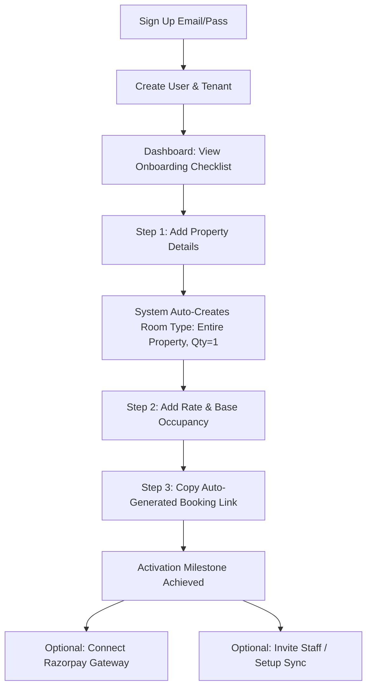
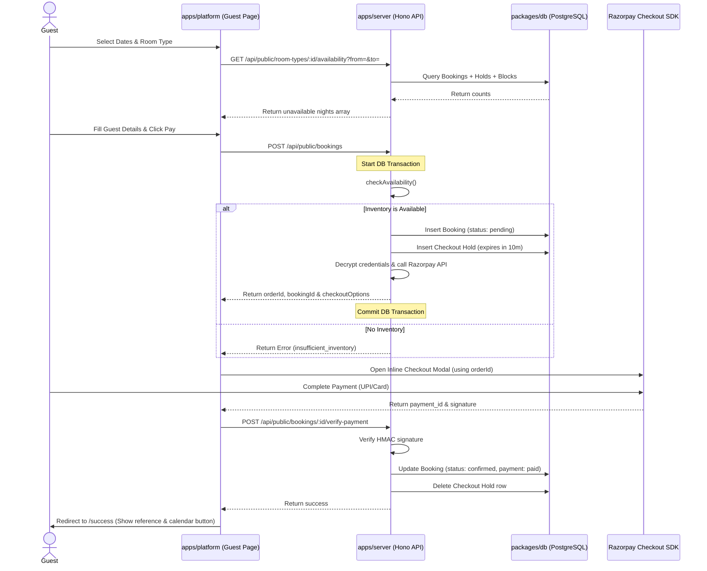

# PropertyOS — User Flows & Journeys

This document outlines the core user journeys of the platform, demonstrating how the unified **Room Type** model supports solo villa hosts, multi-inventory boutique hotels, and multi-property managers under a single, cohesive workflow.

---

## 1. Host Onboarding & Activation Flow
**Who:** Any new host registering on PropertyOS.
**Goal:** Sign up, configure inventory, and copy a functional booking link in under 10 minutes.

1. **Sign Up:** Host enters email and password. Hono server creates a `user` and a `tenant` record. The tenant is assigned a slug (`tenantSlug` e.g., `sunrise-retreats`).
2. **Onboarding Checklist:** A persistent checklist widget appears on the host dashboard showing remaining activation steps.
3. **Property Creation:** Host submits the "Add Property" form. System creates a `properties` record (e.g. `villa-1`).
4. **Auto-Room Type Generation:** Behind the scenes, the system creates a `room_types` record with `name = "Entire Property"`, `quantity = 1`, and links it to the property.
5. **Rate Setup:** Host sets the nightly rate and occupancy limits. The system writes these directly to the auto-created `room_types` record.
6. **Booking Link Generation:** Host copies the public booking link `/book/sunrise-retreats/villa-1` which is now ready to convert guests.

---

## 2. Priya — Solo Villa Host Journey
**Who:** Solo host with 2 independent villas in Goa.
**Goal:** Share a direct payment link with a repeat guest to bypass OTA commissions.

### Step-by-Step Flow:
1. **Guest WhatsApp Inquiry:** A past guest WhatsApps Priya asking to book Villa A from June 10–13.
2. **Host Checks Availability:** Priya opens her PropertyOS dashboard on her phone, views the **Calendar**, and sees the dates are open.
3. **Generate Custom Quote (Private Link):**
   - Priya clicks "Generate Link" -> selects **Private Link**.
   - She locks the dates to **June 10–13**.
   - She overrides the base rate of ₹10,000 to ₹9,000 (special return-guest discount).
   - She toggles **Hold Inventory = True** (pre-reserves the room for 24 hours).
   - System creates a `booking_links` record with a secure token: `/book/p/xyz-987`.
4. **Share on WhatsApp:** Priya copies the wa.me link and WhatsApps it to the guest.
5. **Guest Completes Booking:** Guest opens the link (pre-filled with dates and rate), fills details, pays via Razorpay, and the booking is confirmed instantly.

---

## 3. Rohan — Boutique Hotel Front-Desk Flow
**Who:** Rohan (Owner) and Front-Desk Staff at an 18-room hotel in Udaipur (8 Standard, 6 Deluxe, 4 Suites).
**Goal:** Manage multi-unit inventory, avoid double-bookings, and handle walk-ins.

### Flow A: Multi-Inventory Walk-In Booking
1. **Walk-In Guest Arrives:** Guest arrives at reception asking for a "Deluxe Room" for 2 nights.
2. **Front-Desk Check:** Staff opens the **Multi-Room-Type Calendar View**.
   - Deluxe Row shows `4/6 available` for tonight and tomorrow.
3. **Create Manual Booking:**
   - Staff clicks "Add Booking" from the dashboard.
   - Selects Property -> Udaipur Hotel; Room Type -> Deluxe; Guest Count -> 2.
   - Enter guest details (Name, Phone, Email).
   - Click "Save".
4. **Atomic Inventory Reservation:**
   - The Hono server runs `checkAvailability(roomTypeId, checkIn, checkOut, units=1)` inside a serialized transaction.
   - Check passes. System writes a `bookings` record with `source = 'manual'`, `status = 'confirmed'`, and `payment_status = 'unpaid'` (guest will pay at check-out).
   - The calendar updates instantly, showing `3/6 Deluxe available` for those nights.

### Flow B: Host Conflict Override
1. **Overbooking Decision:** A VIP guest demands a Suite that is blocked due to a minor maintenance issue (blocked by an `availability_rule` with `rule_type = 'blocked'`).
2. **Bypass Lock:** Manager (with `override_availability` permission) creates a manual booking.
3. **System Warning:** The availability engine flags: `insufficient_inventory (blocked by maintenance)`.
4. **Confirm Override:** Manager clicks "Confirm & Override" and types a reason ("VIP guest override"). The system saves the booking, records the reason in the audit trail, and increments the occupied count (Suite inventory goes to -1, reflecting the oversell).

---

## 4. Meera — Multi-Property Manager Workflow
**Who:** Property manager with 12 villas owned by different clients across Coorg.
**Goal:** Scope staff permissions, track performance, and generate monthly owner payouts.

### Step-by-Step Flow:
1. **Staff Scoping:**
   - Meera hires a caretaker, Sagar, for the Coorg cluster (3 villas).
   - She invites Sagar via email: `staff/invite`.
   - In Sagar's `staff_members` record, she scopes `property_ids` to only the 3 Coorg villas, leaving financial permissions unchecked.
   - Sagar logs in. He can see arrival lists and update check-in status for those 3 Coorg villas, but sees no financial dashboards, coupons, or other properties.
2. **Owner Payout Calculation:**
   - At the end of the month, Meera opens the **Owner Payouts** tab.
   - She selects Owner -> Ramesh (owns Coorg Villa 1 and Villa 2).
   - System aggregates all bookings for Ramesh's villas with check-out dates in the current month.
   - System calculates Meera's management cut (e.g., 15% of gross tariff) and backs out expenses logged (e.g., ₹5,000 plumbing repair).
   - Generates a PDF statement: Gross Bookings, PropertyOS Fees (₹0), Management Commission, Deductible Expenses, and Net Payable to Ramesh.
   - Meera clicks "Send Statement" to email Ramesh the report.

---

## 5. Guest Booking & Checkout Flow (Razorpay)
**Who:** A public guest visiting the host's direct booking page.
**Goal:** Safely reserve a room type and pay online.

1. **Dates & Availability Check:**
   - Guest opens `/book/sunrise-retreats/villa-1`.
   - The React page fetches unavailable nights. If a night has `0` Deluxe rooms left, that night is greyed out.
2. **Submit Booking Request:**
   - Guest selects June 10–13, inputs details, and clicks "Pay".
   - Client sends POST request to `/api/public/bookings`.
3. **Atomic Hold Allocation:**
   - Server starts a database transaction.
   - It runs `checkAvailability()` for the room type.
   - If available, it inserts a new `bookings` record with `status = 'pending'`, and inserts a `checkout_holds` record with `expires_at = NOW() + 10 minutes`.
   - Server calls Razorpay `/orders` endpoint using the host's decrypted credentials, creating a gateway order.
   - Transaction commits, returning order details to the client.
4. **Inline Payment Widget:**
   - The React app opens the Razorpay overlay inline. The guest pays ₹25,000 using UPI.
5. **Verification & Confirmation:**
   - On success, the Razorpay SDK returns a payment signature.
   - React app posts the signature to `/verify-payment`.
   - Hono server verifies the HMAC signature. It updates the booking `status = 'confirmed'`, `payment_status = 'paid'`, and deletes the `checkout_holds` row (freeing the checkout hold, since it is now a confirmed booking).
   - Guest is redirected to the success screen where they can download their calendar invite (`.ics`).
